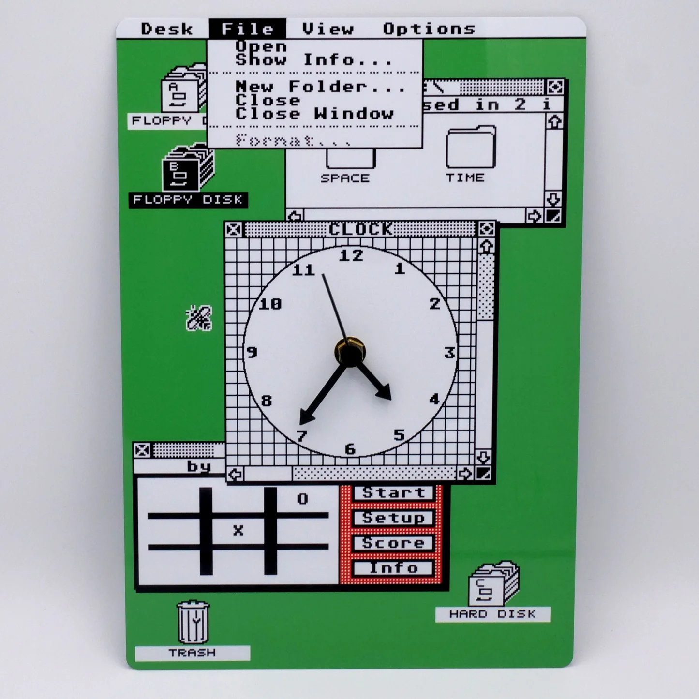
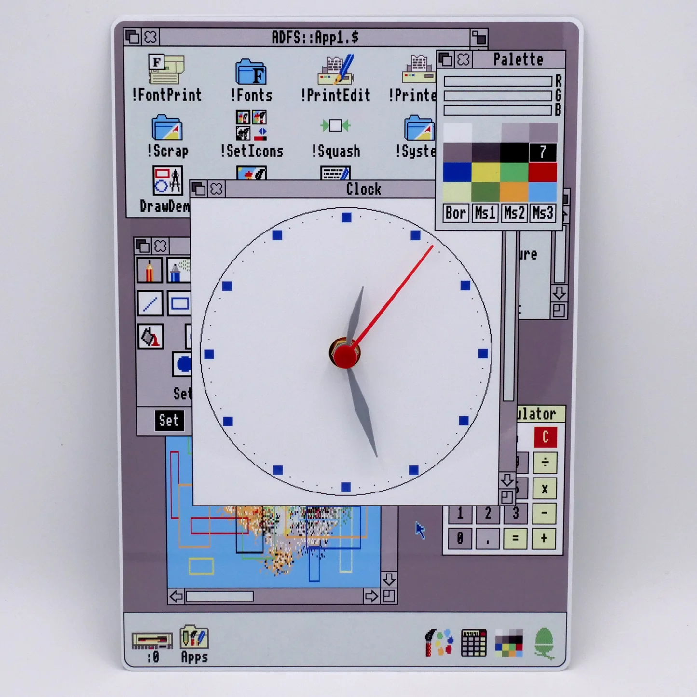
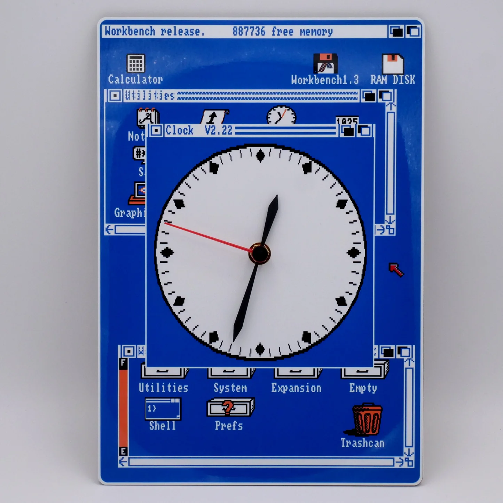
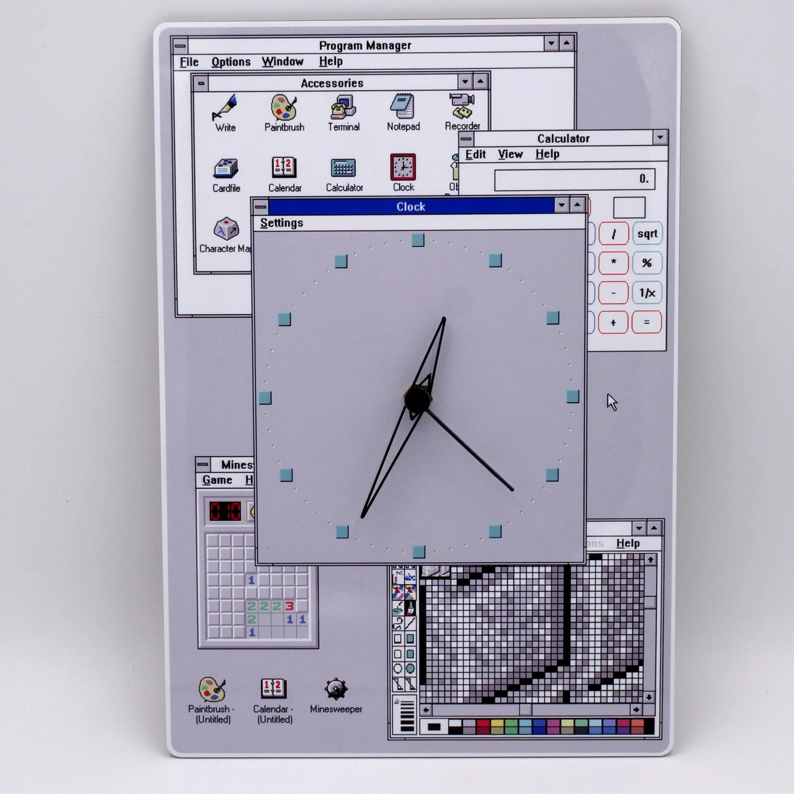

# Windows 3.1 Style Clock

用Cursor基于Next.js开发的Windwos风格时钟,部署在vercel上,[点击查看](https://windwos-clock.programnotes.cn).

## 声明

所有图片素材源来自网络,仅供学习参考,请勿用于商业用途.

- [来源](https://rmcretro.store/products/windows-3-1-style-clock)

## 鸣谢

- [Next.js](https://nextjs.org/)
- [Cursor](https://www.cursor.com/)
- [Vercel](https://vercel.com/)